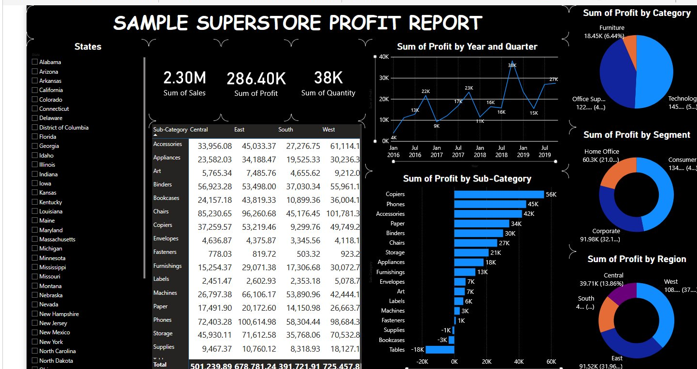

# Sample Superstore Profit Report — Power BI Dashboard

An interactive Power BI dashboard analysing the classic **Sample Superstore** dataset —
sales, profit, quantity, regional performance, customer segments, and product categories —
built to surface where the business makes and loses money.

**▶ Live dashboard:** [View on Power BI Service](https://app.powerbi.com/groups/me/reports/b0b971b7-e29d-4a8b-937c-12c90ca7edd7/ReportSection?experience=power-bi)

---

## Dashboard preview

<!-- Add a screenshot at docs/dashboard.png, then uncomment the line below:

-->

> Add a screenshot to `docs/dashboard.png` (open the `.pbix` in Power BI Desktop and capture
> the report, or screenshot the live dashboard above), then uncomment the image line in this
> file so it displays here.

## Key metrics

| Metric | Value |
|--------|------:|
| Total sales | 2.30M |
| Total profit | 286.40K |
| Total quantity | 38K |

## Highlights

- **Top profit contributors:** Technology category, Consumer segment, and the West & East regions.
- **High-performing sub-categories:** Copiers, Phones, and Accessories.
- **Loss-making areas flagged:** Tables, Bookcases, and Supplies.
- **State-level filtering** plus region / category / segment breakdowns to drill into performance.

## Features

KPI cards, slicers, matrix tables, line / bar / pie / donut charts, drill-down, and page
navigation. Data shaped in **Power Query (M)** with **DAX** measures, then published to the
**Power BI Service** for web-based, interactive access.

## Dataset

The Sample Superstore dataset (the classic retail sample, widely available on Kaggle):
https://www.kaggle.com/search?q=sample+superstore

## How to use

- **Easiest:** open the live dashboard link above — no install needed.
- **To explore the build:** open `Sample_Superstore_Profit_Report.pbix` in
  [Power BI Desktop](https://powerbi.microsoft.com/desktop/) (free) to inspect the data model,
  Power Query steps, DAX measures, and visuals.

## Author

**Sathwik Kataradahalli Sumanth** — MSc Data Analytics, National College of Ireland
[LinkedIn](https://linkedin.com/in/sathwik-k-s-88964b286) · [GitHub](https://github.com/Sathwik-0102)
